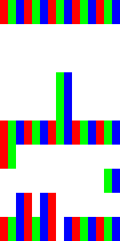

# Introducing: "The worlds smallest videogame*"
This repo contains a game of frogger, contain entirely within a 5x10 pixel html canvas**.

## How?

Each pixel of an LCD display actually consists of three smaller 'subpixels's, one for red, one for green, and one for blue.

By abusing the fact that most LCD displays share a subpixel layout in common (that being three vertical stripes, in 'RGB' order), we can treat a single RGB LCD pixel as if it was three seperate monochrome pixels.

## Instructions:

Open either game.html (for the vanilla experience), or gamewithsimulator.html (for a simulated subpixel display) and use 'wasd' to move your frog.

  

Your goal is to navigate to the top of the screen without being hit by a car (the moving pixel blobs on the bottom half of the screen), or falling into the water (the black blob in the top half of the screen).

  

If you lose, just refresh and try again.

  
  

## Images
### Simulated Gameplay

  
  
### Real Life Images
Although I could see the game taking place with my naked eye, I had trouble taking a coherent photo of gameplay. If anyone has any ideas, or if you manage to take a photo please let me know :).

\* No attempt at verification made.

\*\* Game only compatible with RGB lcd displays.
